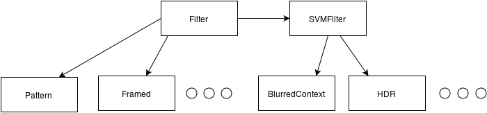

.. _architecture:

Project architecture
********************

The project's folder structure and architecture have been kept simple::

    .
    ├── celery_conf
    ├── docs
    ├── qualipy
    │   ├── data
    │   │   ├── object_extraction
    │   │   └── svm
    │   ├── filters
    │   └── utils
    └── tests
        ├── accuracy
        ├── filters
        ├── images
        └── utils

The qualipy folder contains the project's main source code. All filters are housed in the qualipy/filters folder, each filter having its own file. Filters are implemented as classes, inheriting the Filter class, defined in qualipy/filters/filter.py. Filters that make use of SVM inherit the SVMFilter class (which in turn inherits the Filter class), defined in qualipy/filters/svm_filter.py. All filters should implement the predict method and have class variables name and speed.

The common functions shared by the filters and the data they use are kept in the qualipy/utils and qualipy/data folders, respectively. For example, the commonly used SVM class can be found in the utils folder and the data files used by SVM filters are located in data/svm. All test files, found in tests/, follow the same folder structure as the module they are testing.

The qualipy.process module exploits the used structure by getting the available filters by inspecting the qualipy.filters package, thus being able to map the names' of the filters to their matching class objects. The process function works by calling the predict function of each of the specified class objects. For this reason thresholds and other parameters are given as parameters to the filter class and not to its predict method - otherwise utilizing the parameters using the process function would be difficult.
