Blurred context
===============

Usage
-----

The filter can be used by itself or in combination with the *qualipy.process* function by adding a **BlurredContext** class instance to the list of filters to be used.

.. currentmodule:: qualipy.filters.blurred_context
.. autoclass:: BlurredContext
   :members:

   .. automethod:: __init__

Performance
-----------

The effect of different thresholds can be seen in the following graph, where x-axis is the threshold and y-axis is the percentage of correct predictions:

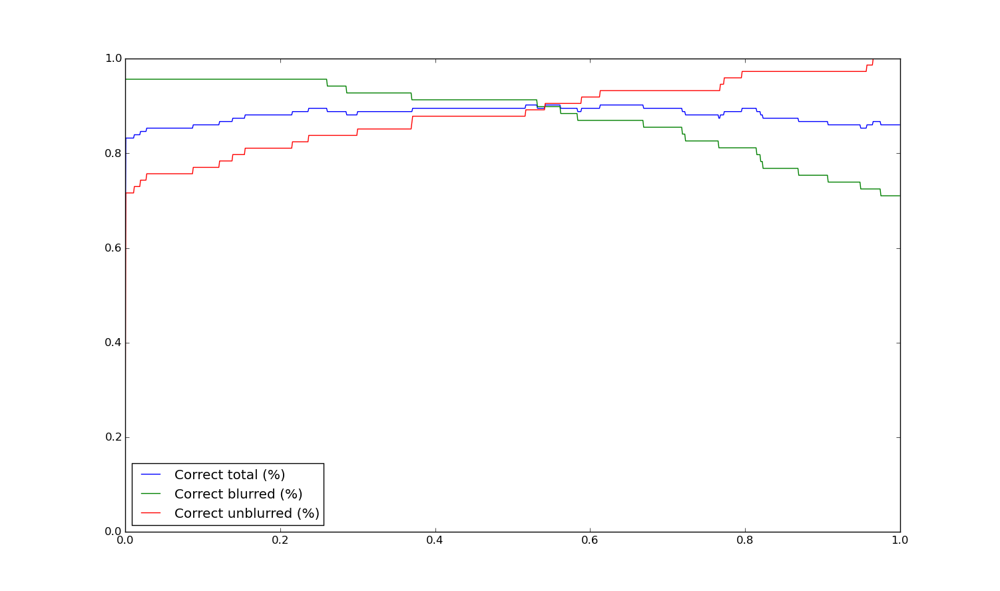

As can be seen from the graph, a threshold of about 0.55 provides the highest total success rate, while choosing e.g. a threshold of about 0.30 provides an ~95% success rate for blurred images, while still having a ~80% success rate for undistorted images.

ROC curve:

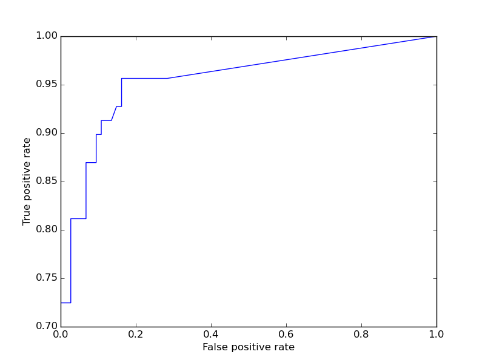

How it works
------------

The filter first constructs a so-called "blur map" from the image using the method described in [1]: for each pixel, its "blurry degree" is estimated using the following formula:

.. math::

    \beta = \frac{\lambda_1}{\sum_{i=1}^5 \lambda_i}

where :math:`\lambda_i` are the singular values obtained by doing a singular value decomposition on a 5px x 5px patch (larger patches can be used for slightly better results, but at cost in runtime) surrounding the pixel. Example blur map:

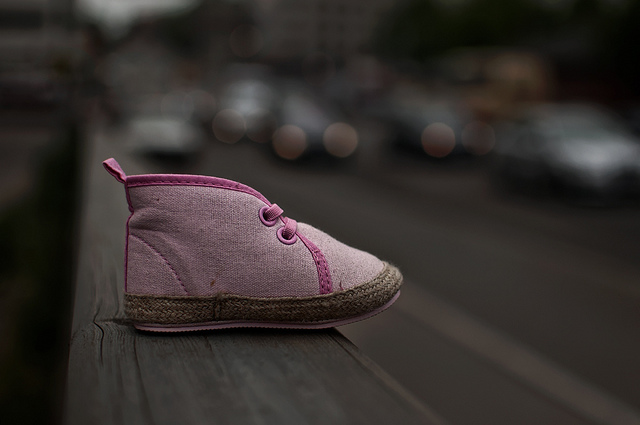
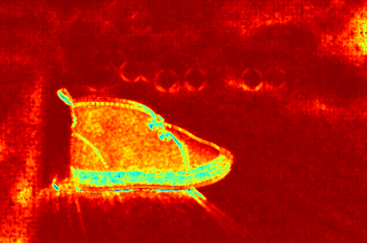

This blur map is then broken into 100 partitions of equal size and the mean value of each partition is used as variable in an input vector that is fed into a support vector machine. The default support vector machine has been trained using 450 blurred and 450 undistorted images that were downloaded from Flickr and labeled by hand.

Sample "blurred context" images from the training set:

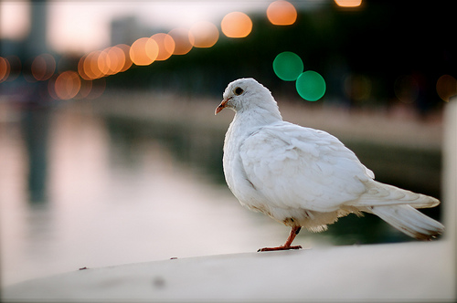
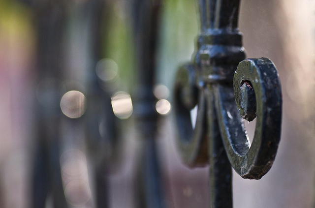
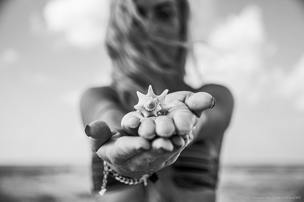

Sample undistorted images from the training set:

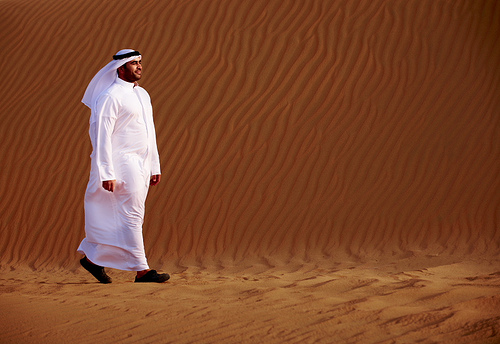
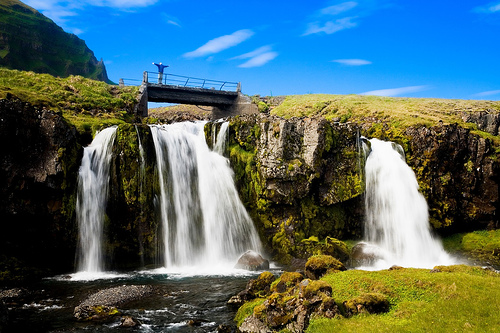
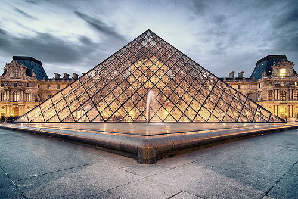

Most false positives result from images having a homogeneous background, such as pictures with a clear sky or water, due to similar blur maps for blurred regions and solid color (it's impossible to tell from a region containing only a solid color whether it's blurred or not). This could possibly be corrected by adding features that deal with the variation of color to the SVM or by adding an additional check for low amount of colors. Sample images that result in false positives:

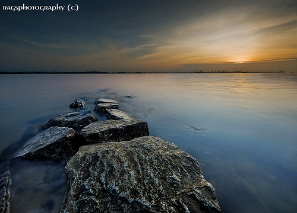
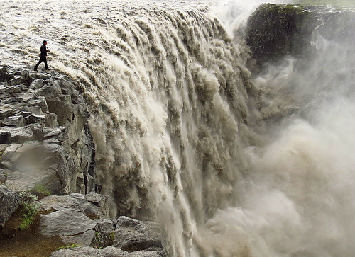

References
----------

1. Su, B.; Lu S.; Tan C. L., *Blurred image region detection and classification*, In Proceedings of the 19th ACM international conference on Multimedia (MM '11), pp.1397-1400, 2011.
