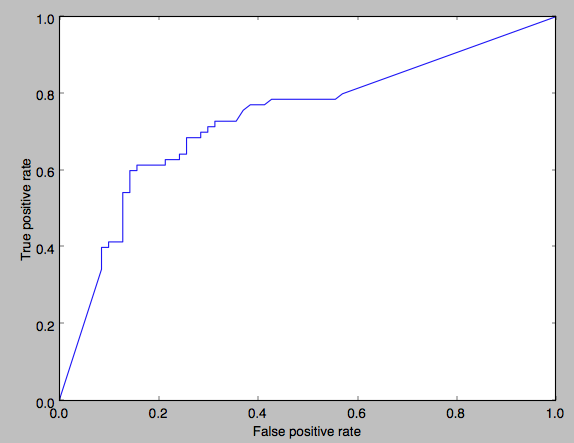

Cross processed
===============

Usage
-----

The filter can be used by itself or in combination with the *qualipy.process* function by adding a **CrossProcessed** class instance to the list of filters to be used.

.. currentmodule:: qualipy.filters.cross_processed
.. autoclass:: CrossProcessed
   :members:

   .. automethod:: __init__

Performance
-----------

ROC curve:

How it works
------------

In order to detect cross processed images, the filter first separates both 20% of the brightest and the darkest pixels in the image. This is useful since usually in cross processed images all dark areas have the same color (not black) and also bright areas have the same color (not white). In order to avoid black and white colors they are removed from the darkest and brightest areas.

After this, three values are calculated for both dark and bright areas: the average sharpness of the peaks, size of an area where there are many pixels and the standard deviation. A value which indicates a normal image is preferred over one indicating a cross processed image, since normal images in this analyzation can look partly cross processed.

Special cases
-------------

The filter has some problems detecting images which have red as one of the magnified colors. This is because red is both at the start and at the end of the hue histogram. When trying to find magnified areas, red is interpreted as two areas instead of one.
