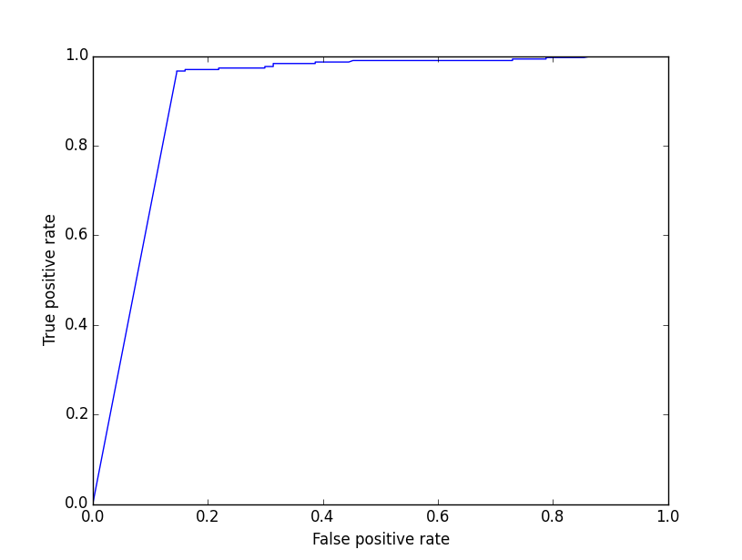
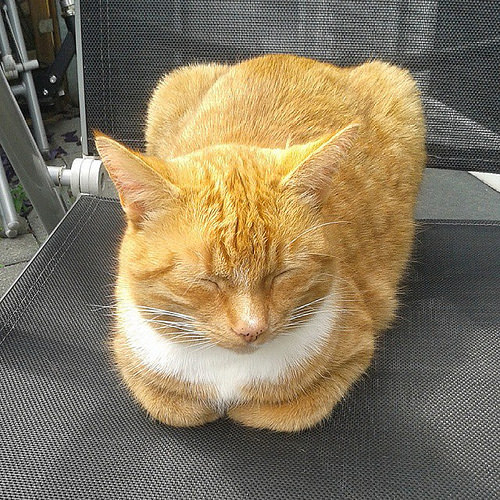
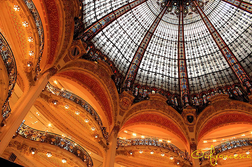
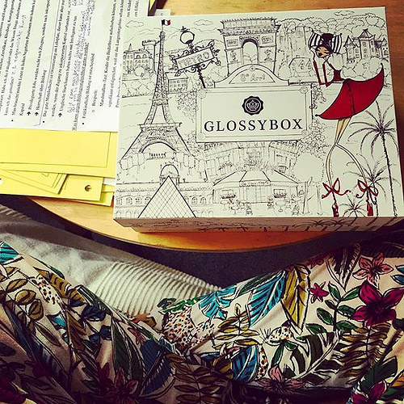

Exposure
========

Usage
-----
This filter is used to recognize over- or underexposed images.
The filter can be used by itself or in combination with the *qualipy.process* function by adding a **Exposure** class instance to the list of filters to be used.

.. currentmodule:: qualipy.filters.exposure
.. autoclass:: Exposure
   :members:

   .. automethod:: __init__

Performance
-----------

ROC curve:

How it works
------------

The image is first converted to grayscale and a histogram of its intensities is produced. The filter then calculates the percentage of pixels with greater than 250 intensity and normalizes the result (result * 50) to a float between 0 and 1. If there are no pixels over 250 intensity, the picture is recognized as underexposed.

Examples:
---------

Sample images recognized as overexposed: (value: 1.0)

.. image:: images/over_exposure_sample.jpg
   :width: 200px

Sample image recognized as underexposed: (value: 1.0)
   
.. image:: images/under_exposure_sample.jpg
   :width: 200px

Sample image not recognized as under- or overexposed: (value: 0.31)

   
In the following images the high-intensity pixels were scattered around the images causing the image to be recognized overexposed, but to human eye they seem quite normal:

   

