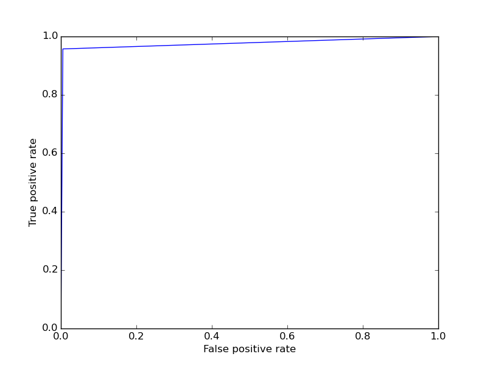
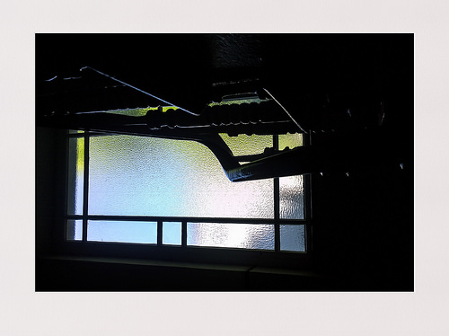
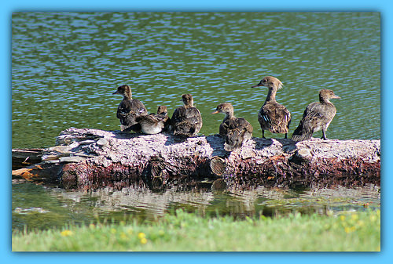
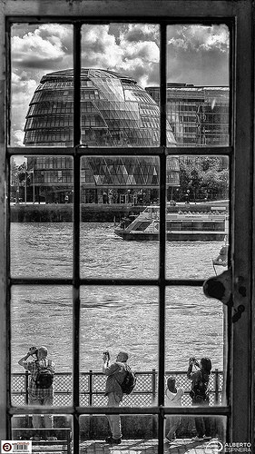
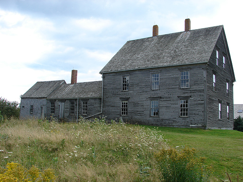
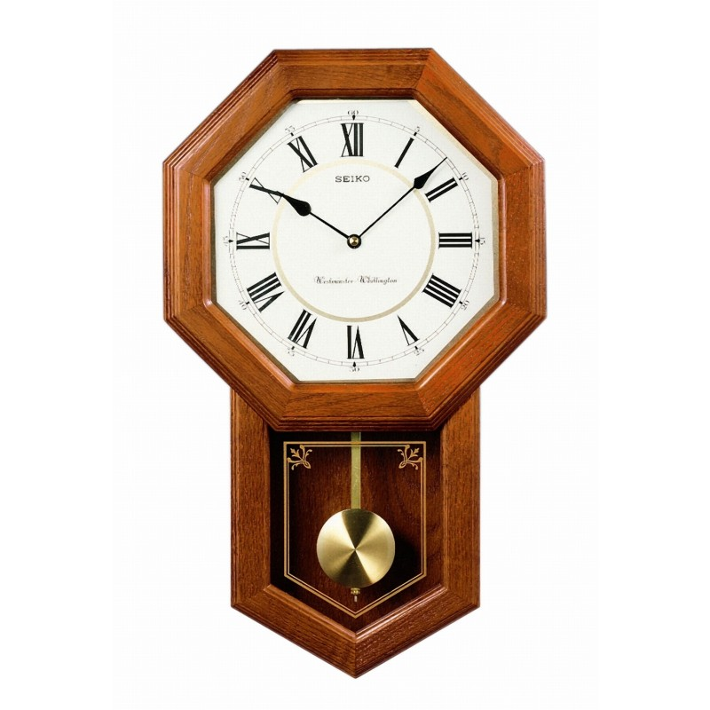

Framed
======

Usage
-----

The filter recognizes images that are framed, or in other words, images that have four homogeneous edges around them. It doesn't recognize images where only two sides are the same color or images where the frames have a texture added in them.
The filter can be used by itself or in combination with the *qualipy.process* function by adding a **Framed** class instance to the list of filters to be used.

.. currentmodule:: qualipy.filters.framed
.. autoclass:: Framed
   :members:

   .. automethod:: __init__

ROC curve:

How it works
------------

The filter first binarizes the image with adaptive thresholding and uses the findContours method from OpenCV to detect any rectangles in the image.

*"Contours can be explained simply as a curve joining all the continuous points (along the boundary), having same color or intensity. The contours are a useful tool for shape analysis and object detection and recognition."*

If the method returns four coordinates (for each corner of the image), they are analyzed to see if they form an rectangle, which is the case in framed images.

Examples:
---------

Sample images recognized as framed: (value: 1.0)

   

Sample images not recognized as framed: (value: 0.0)

Pictures with homogeneous or mono-color backgrounds that surround the object can produce false positives such as the following:

.. image:: images/framed/false_pos2.jpg
   :width: 300px
