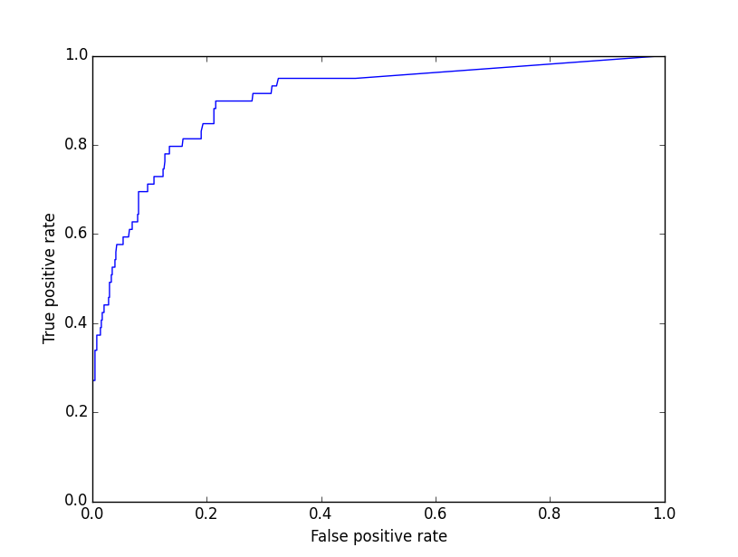
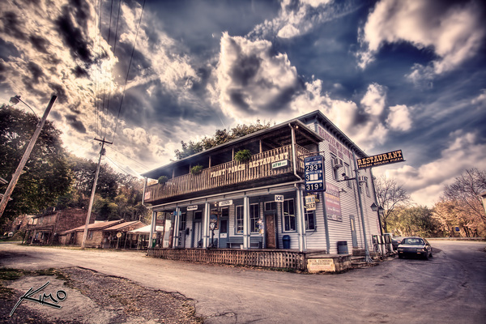
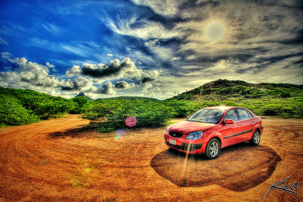
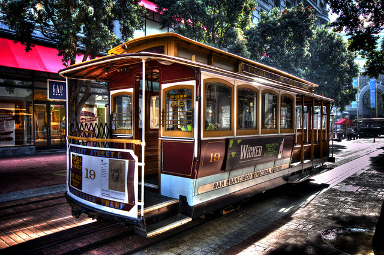
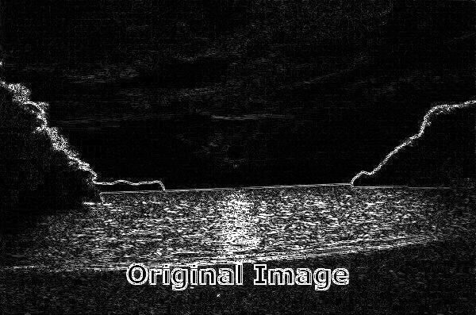
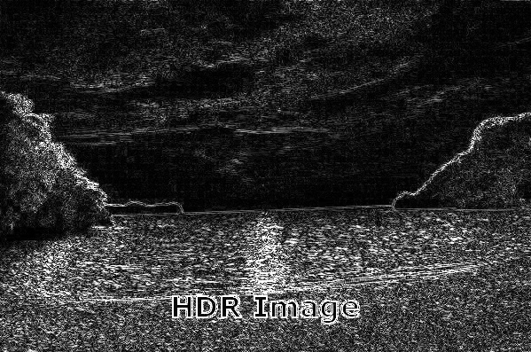
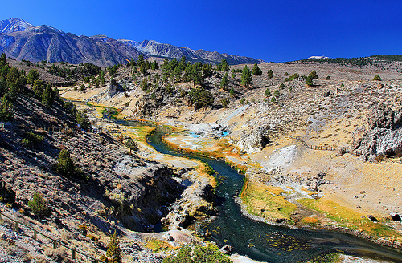
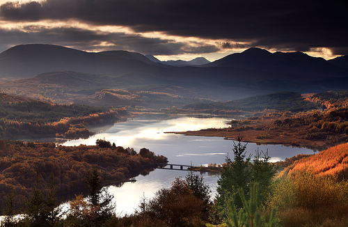

HDR
===

Usage
-----

The filter can be used by itself or in combination with the *qualipy.process* function by adding a **HDR** class instance to the list of filters to be used.

.. currentmodule:: qualipy.filters.hdr
.. autoclass:: HDR
   :members:

   .. automethod:: __init__

Performance
-----------

ROC curve:

How it works
------------

We focus on detecting images that have a very noticeable or bad HDR effect, for example:

Several features based on experimentation are looked for in images. As the objective of high-dynamic-range imaging is to reproduce a greater dynamic range of luminance, we look at the luminance of the image by extracting the Y channel of the image converted into the `XYZ <https://en.wikipedia.org/wiki/CIE_1931_color_space>`_ color space. We also consider the chrominance of the image (as luma is typically paired with chrominance) by looking at the U and V channels of the image converted into the `YUV <https://en.wikipedia.org/wiki/YUV>`_ color space.

Additionally, we calculate the contrast of the image, as HDR images often exhibit a lower amount of contrast than normal images (broadening the tonal range comes at the expense of decreased contrast). The contrast is calculated with the `root mean squared contrast <https://en.wikipedia.org/wiki/Contrast_(vision)#RMS_contrast>`_ formula. The final feature is the amount of edges present in comparison to the size of the image, calculated using a Laplacian edge detector. HDR images usually have a higher amount of edges present than their normal counterparts:

.. image:: images/nonhdr.jpg
   :width: 325px

.. image:: images/hdr.jpg
   :width: 325px

Finally, these features are fed into a support vector machine, which has by default been trained with 200 non-HDR and 200 HDR images collected from various sources and labeled by hand.

Most false positives result from either very sharp images or images having many large dark areas. Additional features would be needed to mitigate these problems. Sample images that result in false positives:

