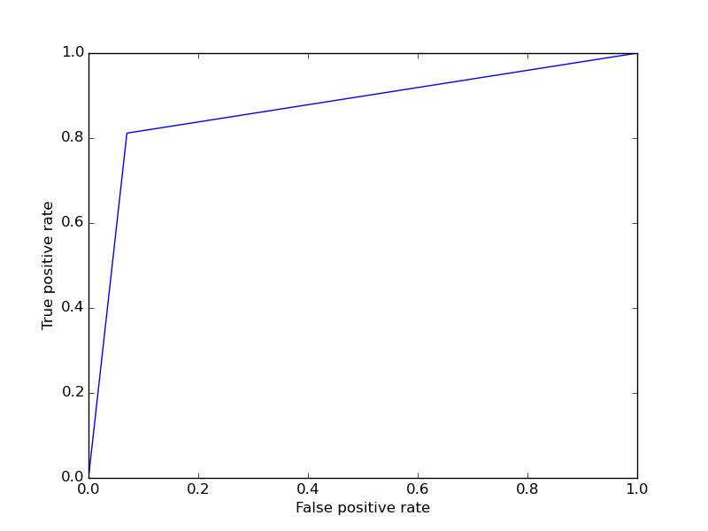
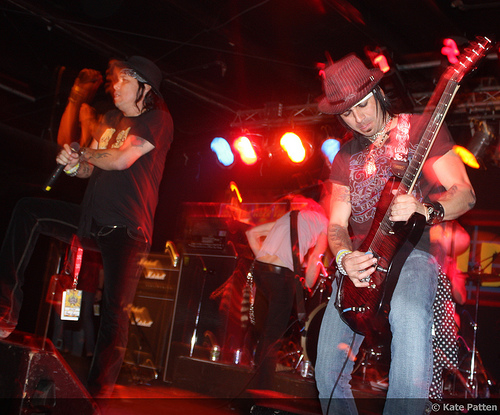
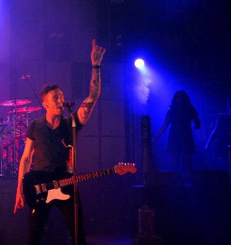
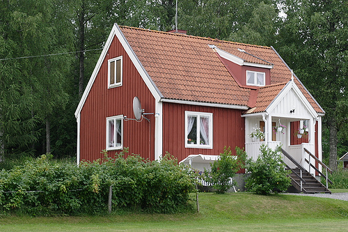
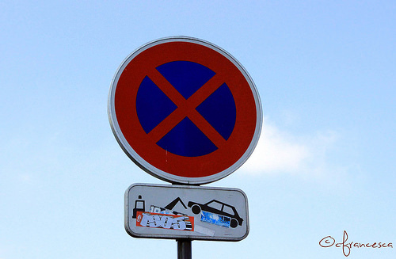
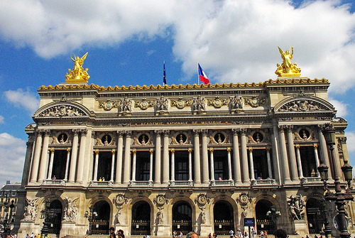

Highlights
========

Usage
-----
This filter recognizes images that contain one or more bright areas for example sun or spotlights from concerts. The difference to exposure-filter is that the bright area must be contiguous and the result is either 0: no highlights, or 1: one or more highlights.
The filter can be used by itself or in combination with the *imgfilter.process* function by adding a **Highlights** class instance to the list of filters to be used.

.. currentmodule:: imgfilter.filters.highlights
.. autoclass:: Highlights
   :members:

   .. automethod:: __init__

Performance
-----------

ROC curve:

How it works
------------

The image is first converted to grayscale and blurred to remove unwanted noise. Then the image is thresholded so that pixels with intensity over 250 are white and the rest are black, to help identify distinct highlighted areas. *cv2.findContours* is then used to count how many highlighted areas exist, after which we check if the areas are too small or rectangular in shape and count the resulting amount of highlighted areas.

Examples:
---------

Sample image recognized as highlighted: (value: 1.0)

Sample image recognized as highlighted: (value: 1.0)
   

Sample image not recognized highlighted: (value: 0.00)

   
Some images where the intensity of the highlight isn't high enough or the highlights aren't large enough can produce false-negatives such as following: 

   
In some cases, the highlight isn't particularly noticeable for human eye, but the small continuous high-intensity area gives the image a positive result.

   

