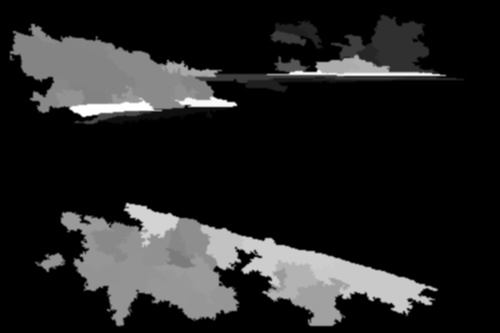
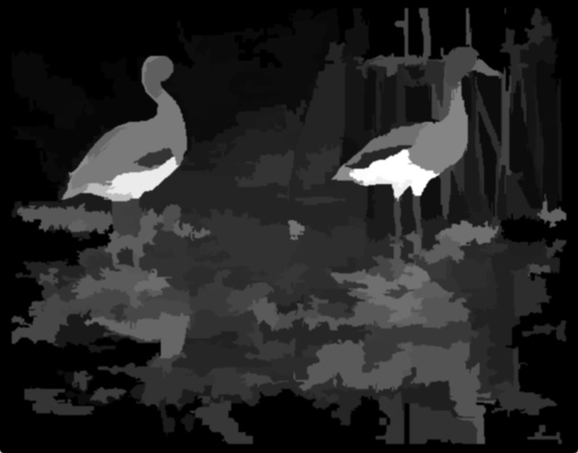
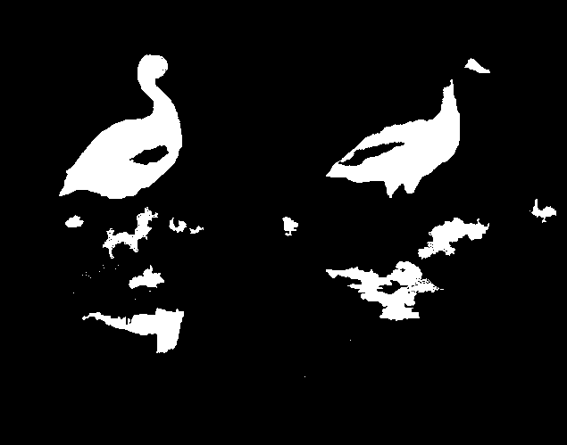
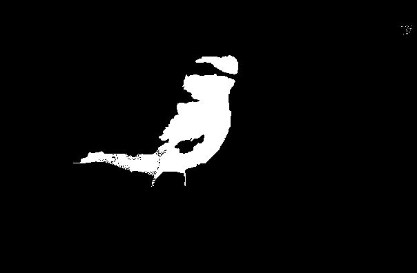

Multiple salient regions
========================

Usage
-----

The filter can be used by itself or in combination with the *qualipy.process* function by adding a **MultipleSalientRegions** class instance to the list of filters to be used.

.. currentmodule:: qualipy.filters.multiple_salient_regions
.. autoclass:: MultipleSalientRegions
   :members:

   .. automethod:: __init__

How it works
------------

First, the full saliency map is extracted using the object extraction algorithm:

The saliency map is binarized using a threshold which is calculated individually
for each image as the weighted average of 3/4 of the biggest saliency values.
Using this threshold, the image is binarized into solid regions. All regions and
their sizes are calculated using OpenCV's contour detection. The actual prediction
is constructed by dividing the sum of the areas of all the regions by the area
of the largest region and squaring the result. This way if the saliency map contains
some small independent areas, the whole image is not considered to have multiple
salient regions. The filter is fully dependent on the object extraction algorithm
used to construct the saliency map. The currently used object extraction algorithm
can be found in [1].

Example of an image which contains multiple salient regions:

Saliency map

Binarized saliency map

For this image, the limit which was used for binarization was 92.65 and
the given prediction was 1.0.

Example of an image which doesn't contain multiple salient regions:

Saliency map

.. image:: images/saliency_map_of_one_saliency_region.png
   :width: 500px

Binarized saliency map

For this image, the limit which was used for binarization was 113.25 and
the given prediction was 0.31.

During testing of the filter, a threshold value of 0.5 was found to be best
suited in practice.

References
----------

[1] `assamite/CmCode - github.com <https://github.com/assamite/CmCode>`_
