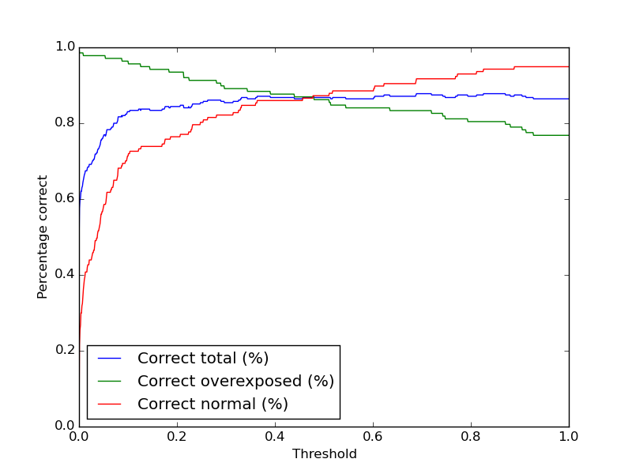
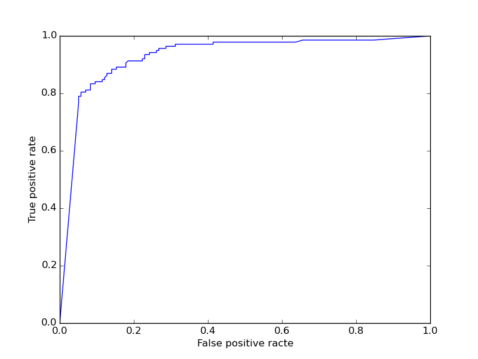

Over exposure detection
=======================

Usage
-----

The filter can be used in combination with the imgfilter.process function by adding a **OverExposed** class instance to the list of filters to be used.

The threshold represents the percentage of pixels in picture that have a greater intensity than 250. For example, a threshold of 0.1 in the graph indicates that pictures with more than 0.2% of pixels with greater intensity than 250 are labeld as over-exposured. (Threshold / 50 = clipping percent)

ROC curve:

How it works
------------

The filter converts the image to grayscale and makes a histogram of it. It then calculates the percentage of pixels with greater than 250 intensity and normalizes the result (result * 50) to a float between 0 and 1.

Examples:
---------

Sample image recognized as over-exposured: (value: 1.0)

.. image:: images/exposure_sample_bad.jpg
   :width: 200px

Sample image not recognized as over-exposured: (value: 0.31)
   
.. image:: images/exposure_sample_good.jpg
   :width: 200px

Sample image not recognized as over-exposured: (value: 0.002)

.. image:: images/exposure_sample_good2.jpg
   :width: 200px

