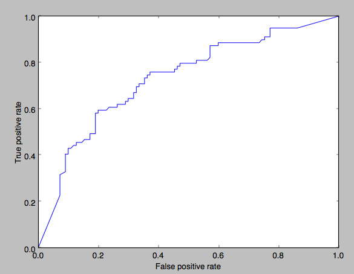
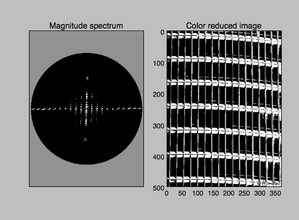
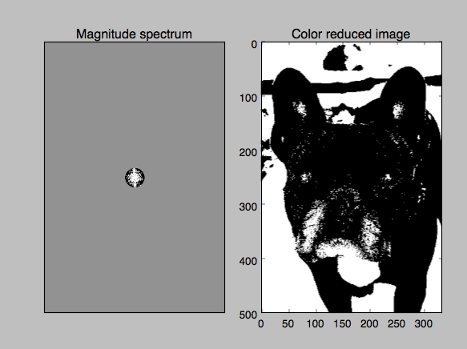

Pattern
=======

Usage
-----

The filter can be used by itself or in combination with the *qualipy.process* function by adding a **Pattern** class instance to the list of filters to be used.

.. currentmodule:: qualipy.filters.pattern
.. autoclass:: Pattern
   :members:

   .. automethod:: __init__

Performance
-----------

ROC curve:

How it works
------------
The image is first turned into grayscale, after which discrete fast fourier transformation is applied to construct the magnitude spectrum of the image. Then frequencies which have intermediate or low intensities are removed from the magnitude spectrum and all frequencies with high intensity are intensified to the max value. After this the distance from the center for each high intensity frequency is calculated. From this set of distances anomalies are removed by using the local outlier factor method [2].

The max from the set of distances is taken. This max distance is then used as a radius for a circle, and all points outside this circle in the magnitude spectrum are excluded and the density of high frequencies is calculated. This density is used to estimate how pattern-like the image is. Pattern-like images usually exhibit smaller density than non-pattern-like images. The inspiration to this method came from [1] and also by looking at magnitude spectrums of both pattern- and non-pattern-like images.

Special Cases
-------------

The filter doesn't work on images which don't have many repetitions of the pattern (like some images of wallpapers). Also, if a single part of the pattern is very complex, the detection may prove problematic. Other difficult cases include for example sparse patterns.

References
----------

[1] `Image pattern detection - Finding similarities in same image - Stack Exchange <http://cs.stackexchange.com/questions/10545/image-pattern-detection-finding-similarities-in-same-image>`_

[2] `Local outlier factor - Wikipedia, the free encyclopedia <http://en.wikipedia.org/wiki/Local_outlier_factor>`_
