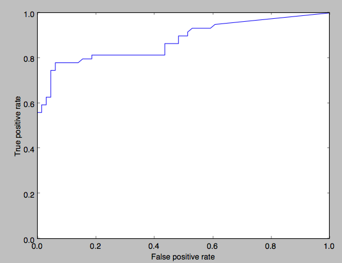
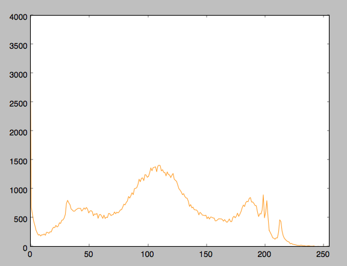
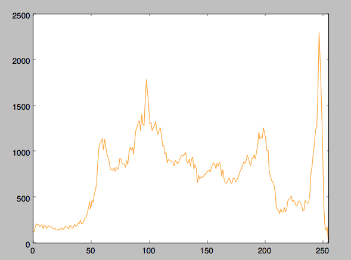

Posterized
==========

Usage
-----

The filter can be used by itself or in combination with the *qualipy.process* function by adding a **Posterized** class instance to the list of filters to be used.

.. currentmodule:: qualipy.filters.posterized
.. autoclass:: Posterized
   :members:

   .. automethod:: __init__

Performance
-----------

ROC curve:

How it works
------------

The posterized image detection first loads the given image as a grayscale image and calculates a histogram of its pixel intensities.
From this histogram the value for each local max point is calculated which measures how sharp the peak is. Calculating the value takes into account
how wide the peak is, meaning how large the distance between the local minimum before and the local maximum after it is. The second feature measured is how large the peak is, meaning how big is the average difference between the value at the local maximum and two local minimums next to it.
Posterized images have naturally more sharp peaks since colors in the image are lacking many different shades.

Histogram of a posterized image

Histogram of a non-posterized image

