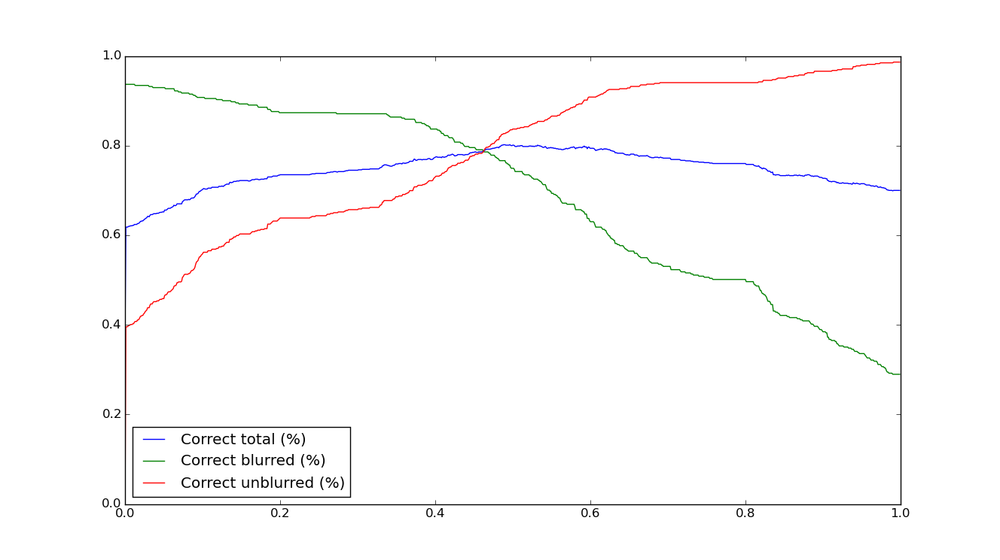
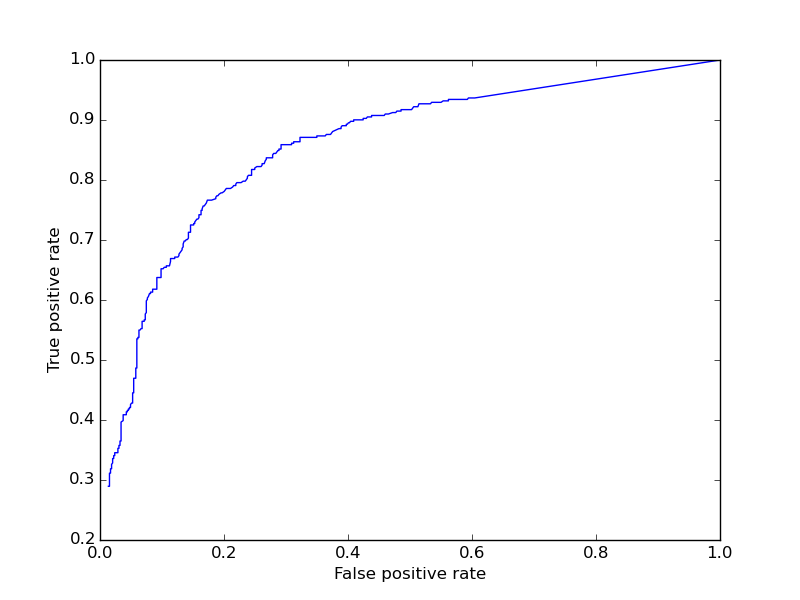
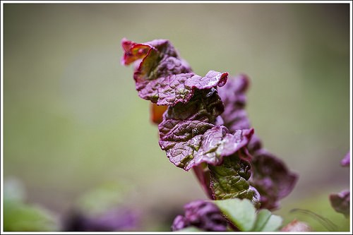

Whole blur
==========

Usage
-----

The filter can be used by itself or in combination with the *qualipy.process* function by adding a **WholeBlur** class instance to the list of filters to be used.

.. currentmodule:: qualipy.filters.whole_blur
.. autoclass:: WholeBlur
   :members:

   .. automethod:: __init__

Performance
-----------

The effect of different thresholds can be seen in the following graph, where x-axis is the threshold and y-axis is the percentage of correct predictions:

As can be seen from the graph, a threshold of about 0.5 provides the highest total success rate, while choosing e.g. a threshold of about 0.35 provides an ~85% success rate for blurred images, while still having a ~70% success rate for undistorted images.

ROC curve:

How it works
------------

Four focus measure algorithms described in [1] are applied to the whole image. Focus measures measure the relative degree of focus of an image, and the implementations are based on their respective `MATLAB implementations <https://www.mathworks.com/matlabcentral/fileexchange/27314-focus-measure>`_. The image is also divided into 5x5 equal-sized rectangles and the focus measures are applied to these parts as well. As described in [2], this is done to avoid the possibility of images having non-blurred parts misleading the focus measures. This trick is known as a spatial pyramid.

The outcomes of the focus measure algorithms for the whole image and the smaller parts are concatenated into an input vector for a support vector machine used for the prediction. By default, the SVM has been trained with the `CERTH Image Blur Dataset <http://mklab.iti.gr/project/imageblur>`_. The final prediction is weighed by analyzing the probability of motion blur from the image's exif data, if possible.

Most false positives are caused by the majority of the image's area (mainly the background) being blurred. The object might still be sharp, thus the whole image is not blurred (the BlurredContext filter should recognize these images), for example:

References
----------

1. Pertuz, S.; Puig D.; Garcia M., *Analysis of focus measure operators for shape-from-focus. Pattern Recognition,* Pattern Recognition, vol.46, no.5, pp.1227-1522, May 2013.

2. Mavridaki, E.; Mezaris, V., *No-reference blur assessment in natural images using Fourier transform and spatial pyramids,* Image Processing (ICIP), 2014 IEEE International Conference on Image Processing, vol., no., pp.566-570, 27-30 Oct 2014.
